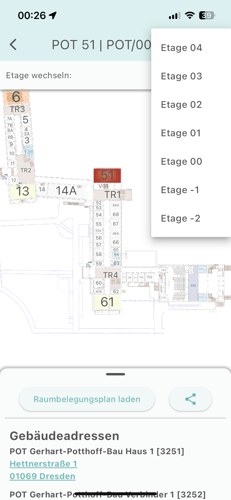

# Flutter Campus Navigator

A WIP flutter app that will hopefully one day replace the https://navigator.tu-dresden.de website.

## Features

* Search for rooms
* Display Building Maps & building addresses
* Display occupancy Tables for Rooms (requires Login)
  * save Login Data for re-use
* WIP: search for empty rooms
* Cache & Prefetching Settings

It works by using the search api and then scraping the returned HTML document to render the campus navigator view in flutter.




## Goals & Non-Goals

This app is supposed to deliver a good user experience for the campus navigator on mobile, therefore perfect feature parity with the website is not the goal of the project.

Goals:
- Have a mobile friendly UI
- Support the most common use cases (eg. finding a room)

Non Goals:
- Support every feature that the website offers (eg. showing the IP address of the router in a room)
- Replicate the exact UI of the website

## Supported platforms

| Plattform         | Status | Supported | 
|--------------|:-----:| :----: |
| iOS | Builded | :heavy_check_mark: |
| MacOS      |  - |  :question:|
| Android |  Builded  | :heavy_check_mark: |
| Linux |  -  | :heavy_check_mark: | 
| Windows      |  - |:question:|
| Web |  Not Planned  | :x: |

### Building

#### APK

```Bash
flutter build appbundle
flutter build apk --split-per-abi
```

Go to `projectFolder\build\app\outputs\apk\releases`

#### iOS

Note: change the sheme according to your target in XCode! (debug for simulator, release for physical device)

#### Updating the App Icon

`dart run flutter_launcher_icons`


#### Side Note About UI Tests

run this to visually see the tests 

`flutter run -t test/widget_test.dart`

### Dependencies

* cupertino_icons: ^1.0.2 [License](https://pub.dev/packages/cupertino_icons/license)
* http: ^1.1.0 [License](https://pub.dev/packages/http/license)
* html: ^0.15.4 [License](https://pub.dev/packages/html/license)
* share_plus: ^7.2.2 [License](https://pub.dev/packages/share_plus/license)
* maps_launcher: ^2.2.1 [License](https://pub.dev/packages/maps_launcher/license)
* flutter_cache_manager: ^3.3.1 [License](https://pub.dev/packages/flutter_cache_manager/license)
* flutter_secure_storage: ^9.2.2 [License](https://pub.dev/packages/flutter_secure_storage/license)
* flutter_launcher_icons: ^0.13.1 [License](https://pub.dev/packages/flutter_launcher_icons/license)
* maps_toolkit: ^3.0.0 [License](https://pub.dev/packages/maps_toolkit/license)
* package_info_plus ^8.1.2 [License](**https://pub.dev/packages/package_info_plus/license**)
* week_number: ^1.1.1
* flutter_localizations: sdk: flutter
* intl: any
