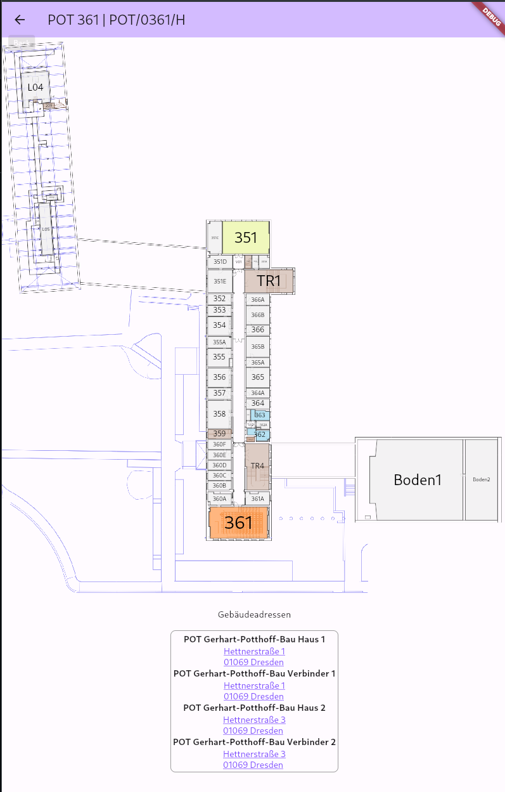

# Flutter Campus Navigator

A WIP flutter app that will hopefully one day replace the https://navigator.tu-dresden.de website.

## Features

* Search for rooms
* Display Building Maps & building adresses

It works by using the search api and then scraping the returned HTML document to render the campus navigator view in flutter.

